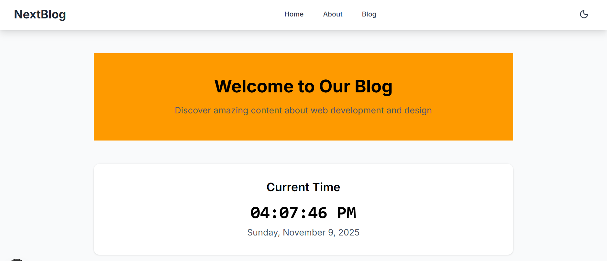

# Next.js Blog Application

A modern blog application built with Next.js, featuring server-side rendering, dynamic routing, and a responsive design.

## 🚀 Features

- Server-side rendering (SSR) for better SEO
- Dark mode support
- Responsive design for all devices
- Dynamic blog posts with [id] routing
- Client-side navigation

## 🛠️ Tech Stack

- **Framework**: Next.js 14
- **Styling**: Tailwind CSS
- **Icons**: Lucide Icons
- **Type Safety**: TypeScript
- **Deployment**: Vercel


## folder structure

nextjs-app/
- ├── src/
- │   ├── app/
- │   │   ├── about/
- │   │   │   └── page.tsx
- │   │   ├── blog/
- │   │   │   ├── [id]/
- │   │   │   │   └── layout.tsx
- │   │   │   ├── layout.tsx
- │   │   │   └── page.tsx
- │   │   ├── components/
- │   │   │   ├── BlogSidebar.tsx
- │   │   │   ├── ClientDateTime.tsx
- │   │   │   ├── ThemeProvider.tsx
- │   │   │   └── ThemeToggle.tsx
- │   │   ├── layout.tsx
- │   │   └── page.tsx
- │   └── styles/
- ├── public/
- │   └── scr.png
- ├── next.config.js
- ├── package.json
- └── README.md

##  Getting Started


### Installation

1. Clone the repository
   ```bash
   git clone [https://github.com/yourusername/nextjs-rendering-assignment.git](https://github.com/yourusername/nextjs-rendering-assignment.git)
   cd nextjs-rendering-assignment/nextjs-app
Install dependencies
bash
npm install
# or

Start the development server
bash
npm run dev
# or
yarn dev
Open http://localhost:3000 in your browser

 Deployment
This project is configured for deployment on Vercel. Push your changes to the main branch to trigger automatic deployments.

Deploy with Vercel

### Key Points About the Structure:


**`public/`**: Static files like images, icons, etc.

**Configuration**:
   - `next.config.js`: Next.js configuration
   - `package.json`: Project dependencies and scripts

**Components**:
   - Reusable UI components are in `src/app/components/`
   - Each component has its own file with a descriptive name


## screenshots


